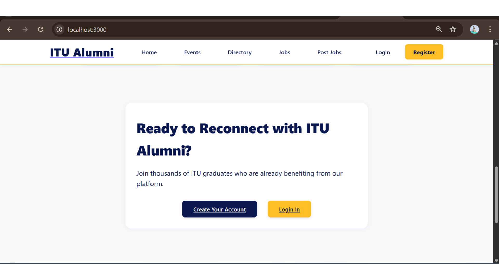
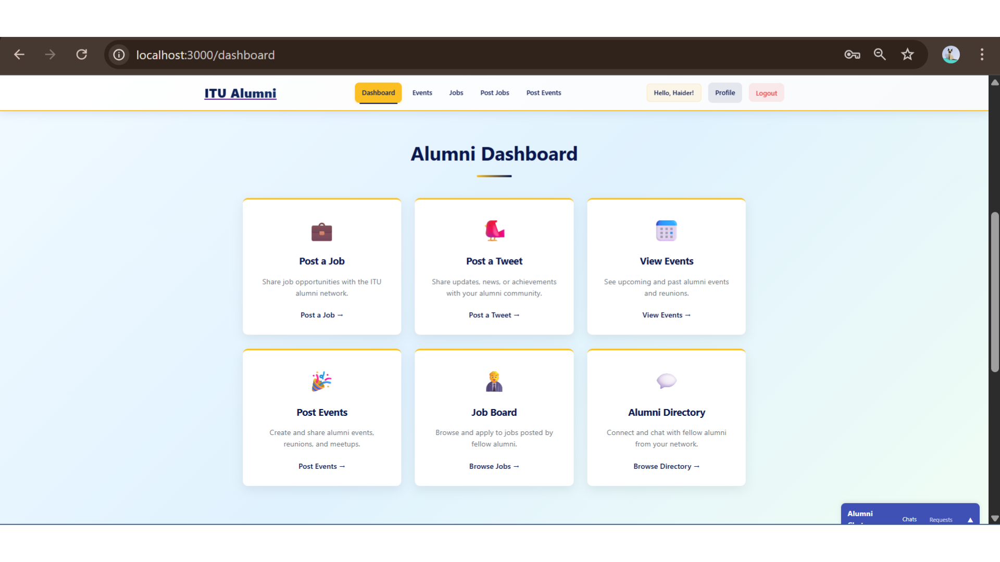
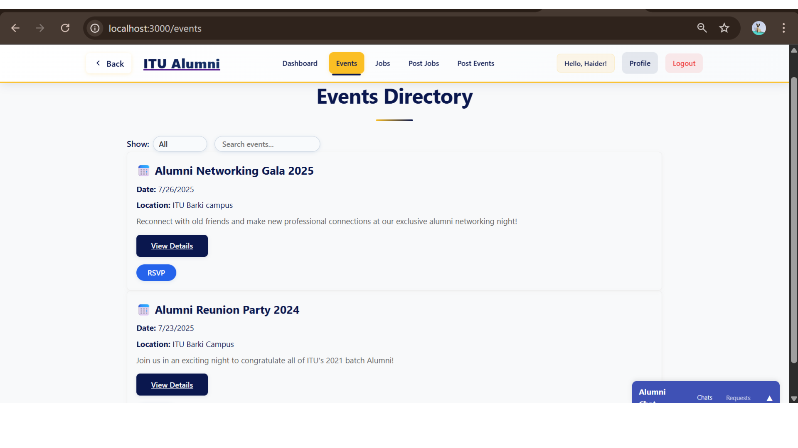
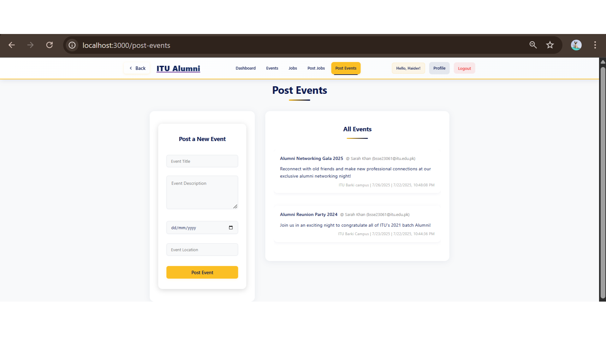
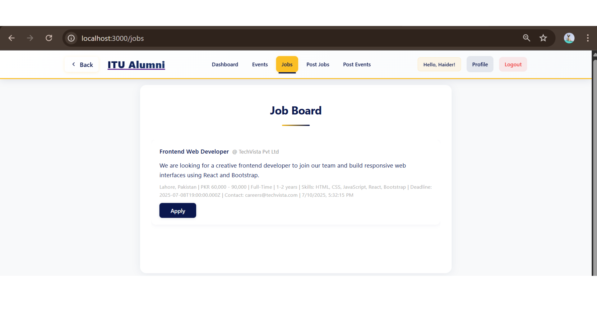
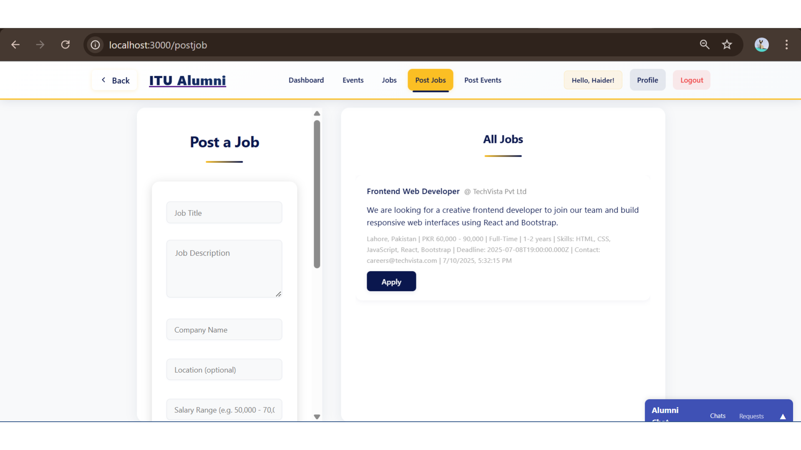
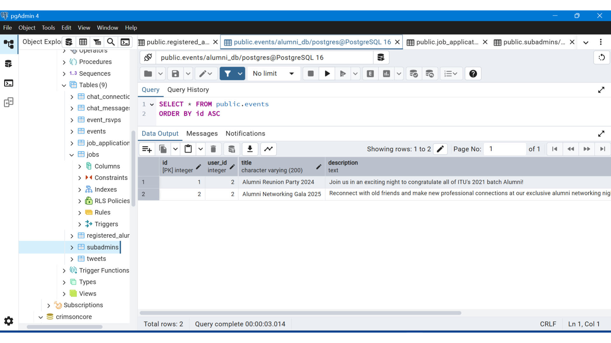

# Alumni Engagement System

A full-stack web application for alumni to stay connected with their institution and each other. Alumni can manage their profile, browse and post events, share updates, explore the alumni directory, use the job board, and chat in real time. Sub-admins and a main admin handle events, requests, and oversight.

## Features

- **Accounts** — Registration and login for alumni (profile fields include batch, faculty, degree, roll number).
- **Dashboard** — Central hub after sign-in with quick access to main areas of the app.
- **Events** — View, discover, and post events; event detail pages.
- **Posts / tweets** — Short updates shared across the community.
- **Jobs** — Job board with postings and applications.
- **Directory** — Find other alumni; integrated chat requests and messaging.
- **Real-time chat** — Socket.IO–powered private messaging between alumni (see `docs/chat-feature.md`).
- **Admin roles** — Sub-admin panels for events and user requests; main admin panel for broader management.

## Tech stack

| Layer | Technologies |
|--------|----------------|
| Frontend | React 18, React Router, Socket.IO client, React Icons |
| Backend | Node.js, Express 5, Socket.IO |
| Database | PostgreSQL (schema in `backend/schema.sql`) |
| Auth | bcrypt, JWT (API routes under `backend/routes/`) |

## Getting started

1. **Prerequisites** — [Node.js](https://nodejs.org/) and PostgreSQL installed locally.

2. **Database** — Create a database, then run `backend/schema.sql` (and any chat setup scripts such as `backend/setup-chat-tables.js` if you use chat). Configure connection details in a `backend/.env` file using `PG*` variables expected by `pg` (for example `PGUSER`, `PGPASSWORD`, `PGHOST`, `PGPORT`, `PGDATABASE`).

3. **Backend** — From the `backend` folder:

   ```bash
   npm install
   npm start
   ```

   The API and Socket.IO server listen on **port 5000** by default.

4. **Frontend** — From the project root:

   ```bash
   npm install
   npm start
   ```

   The React app runs on **port 3000** and expects the backend at `http://localhost:5000`.

## Screenshots

### Create account



### Dashboard


### Profile



### Events and directory



### Post events



### Job board





### Database (pgAdmin)



## Project Supervisor Details

| Detail | Information |
| :--- | :--- |
| **Name & Title** | Dr. Muhammad Asif (Postdoctoral - US, Assistant Professor) |
| **Department** | Department of Computer and Software Engineering, Faculty of Engineering |
| **Institution** | Information Technology University (ITU), Lahore, Punjab, Pakistan |
| **Email** | [muhammad.asif@itu.edu.pk](mailto:muhammad.asif@itu.edu.pk) |

